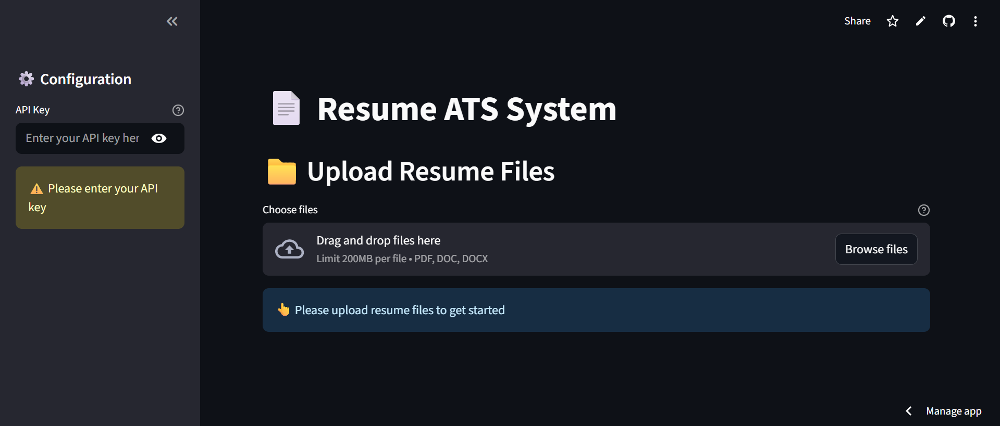

# ATS System

## Overview

ATS System is an AI-powered Resume Evaluation and Applicant Tracking System (ATS) designed for legal, IP, and startup-facing roles. It uses advanced scoring rubrics and integrates with Azure OpenAI to automate resume screening, scoring, and recommendations.

## Features

- Upload multiple resumes (PDF, DOC, DOCX) via a Streamlit web interface.
- Automated scoring based on legal/IP/startup experience, skills, education, and cultural fit.
- Uses Azure OpenAI for intelligent resume evaluation.
- Generates detailed Excel reports with scores, recommendations, and justifications.
- Secure API key management.

## HomePage


### Prerequisites

- Python 3.12+
- Azure OpenAI API Key
- All dependencies listed in `requirements.txt` or `pyproject.toml`

### Installation

1. Clone the repository:
   ```sh
   git clone https://github.com/ITCartofficial/ATS_System.git
   cd ATS_System
   ```

2. Install dependencies:
   ```sh
   pip install -r requirements.txt
   ```

3. Set your Azure OpenAI API key:
   - Create a file named `.api_key` in the project root and paste your API key inside.

### Usage

1. Start the Streamlit interface:
   ```sh
   streamlit run interface.py
   ```

2. Upload resume files and enter your API key in the sidebar.

3. Click "Process Resumes" to generate the ATS report.

4. Download the results as an Excel file.

## File Structure

- `main.py`: Core logic for resume evaluation and scoring.
- `interface.py`: Streamlit web interface for uploading and processing resumes.
- `create_template.py`: Script to generate the Excel scoring template.
- `template.xlsx`: Excel template for scoring.
- `requirements.txt` / `pyproject.toml`: Python dependencies.
- `LICENSE`: MIT License.

## License

This project is licensed under the MIT License.

---
